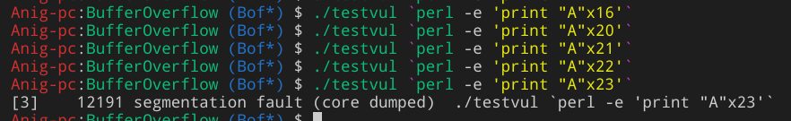

# BufferOverflow

主要基于 github 仓库 [InsecureProgramming](https://github.com/gerasdf/InsecureProgramming) 学习

- 来源
  - The use of the non-type safe C/C++ language
  - Accessing or copying a stack buffer in an insecure manner
  - The compiler places buffers next to or near critical data structures in memory.

## Introductory

### X86 Architecture

#### Basic registers

- 8 general-purpose registers - 32 bits

  - Data
  - Index
  - Pointer


| Register Name |                                        Purpose                                        |  Attribute   |
| :-----------: | :-----------------------------------------------------------------------------------: | :----------: |
| AL,AH/AX/EAX  |            Accumulator,holds result of arithmetic ops and func rtn values             |   Special    |
| BL, BH/BX/EBX |   Base,\*(DS segment)，store the base adr of the program,usually set 0 to accurate    | Non-Volatile |
| CL, CH/CX/ECX |         Counter,used to hold times a process repeated,for loop and string ops         |   Volatile   |
| DL, DH/DX/EDX |                   Data,also for I/O ops,helps extend EAX to 64bits                    |   Volatile   |
|    SI/ESI     | Source Index,\*\*(DS segment),as offset adrs in str,array ops.holds adrs to read data | Non-Volatile |
|    DI/EDI     |  Destination Index,offset adrs in str,array ops,holds implied write adrs of str ops   | Non-Volatile |
|    BP/EBP     |                  Base,\*(SS segment),bottom,for refering local vars                   | Non-Volatile |
|    SP/ESP     |                   Stack,\*(SS segment),top,for refering local vars                    |   Special    |

- 6 segment registers - 16 bits
  - ZF (Zero Flag):1 if result is zero. 0 otherwise.
  - SF (Sign Flag):Set equal to the most-significant bit of the result. Sign bit for a signed integer.
  - CF (Carry Flag):Overflow condition for unsigned arithmetic.
  - OF (Overflow Flag):Overflow condition for signed arithmetic.
  - PF (Parity Flag):1 if the least-significant byte of the result contains an even number of ones. 0 otherwise.
  - AF (Adjust Flag):1 if the arithmetic operation generated a carry/borrow out of bit 3 of the result. Used in Binary-Coded Decimal (BCD) arithmetic


- 1 EFLAGS register - 32 bits


- 1 EIP,Instruction Pointer register - 32 bits

#### Other Registers

- System
  - I/O ports
  - Control registers(CR0,...,CR4)
  - Memory magagement registers(GDTR,IDTR)
  - Debug registers
  - ...

#### instruction

can not memory to memory with a single instruction

- Opcode
  - What to do
- Source operand
  - Immediate: a constant embedded in the instruction itself
  - Register
  - Memory
  - I/O port
- Destination operand
  - Register
  - Memory
  - I/O port

### StackOverflow

#### testvul.c

```c
/*testvul.c*/

int main(int argc, char *argv[ ])
{
       char buffer[15];
       strcpy(buffer, argv[1]);
      return 0;
}
```

- `gcc -o testvul testvul.c -fno-stack-protector`



- 为何在输入 23 时字节才报错？
  - 编译器可能会为中间表达式保留空间，但是源代码中没有给它们命名
  - ？
- `gcc -o testvul testvul.c -fno-stack-protector`


- 没有任何对齐措施？

#### stack1.c

```c
/* stack1.c
specially crafted to feed your brain by gera */

int main() {
    int cookie;
    char buf[80];

    printf("buf: %08x cookie: %08x\n", &buf, &cookie);
    gets(buf);

    if (cookie == `0x41424344`)
        printf("you win!\n");
}
```

观察函数，我们可以得到以下信息：

- cookie 定义在 buf[ ]之前，

### reference

- [Bufferoverflow](https://www.tenouk.com/Bufferoverflowc/Bufferoverflow1.html)
- [C Function Call Conventions and the Stack](https://www.csee.umbc.edu/~chang/cs313.s02/stack.shtml)
- [geras-wuos-stack1-solutions](https://7h3ram.github.io/2012/geras-wuos-stack1-solutions.html)

## Buffer Overflows

## Format Strings

## Numeric

## Esoteric

## Signals
