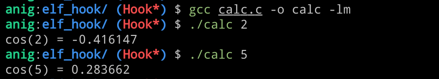
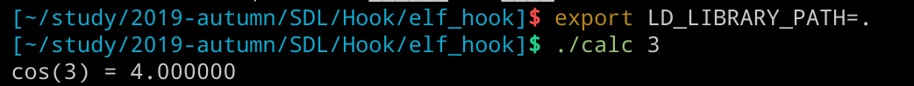

## elf hook

目标：hook 一个库函数，比如当计算`cos(x)`时，输出结果为`x+1`

### step 1

```c

#include <stdio.h>
#include <stdlib.h>
#include <math.h>

int main(int argc, char **argv) {
  if (argc != 2) {
    printf("Usage: %s <a> \n", argv[0]);
    exit(-1);
  }

int a = atoi(argv[1]);
printf("cos(%d) = %f\n", a, cos(a));
return 0;

```

使用以下命令编译成一个只能计算 cos 的`calc`

`gcc calc.c -o calc -lm`

> "-lm" Compiling C program with math.h library in Linux



### step 2

用来 hook 的函数～ 命名为`hook.c`

```c
double hook(double x) {
  return x + 1;
  //return (double)((int)x + 3);
}
```

通过以下命令生成要被 hook 进的部分
`gcc -Wl,--script=./map.ld -Os -nostdlib -nodefaultlibs -fPIC -Wl,-shared hook.c -o hook`

`export LD_LIBRARY_PATH=.`

- `-Wl，--script=`

  - 控制共享库中的导出符号
  - 例如此处的`map.ld`代表 hook 的 text 分布
    ```
      SECTIONS
    {
    .text : { *(.text .data) }
    }
    ```
  - 不设置则按默认来 location，此处也可以省略。`ld --verbose` 显示系统预设的 linkder script

- `-Os`

  - Optimize for size

- `-nostdlib`,`-nodefaultlibss`
  - 链接时不使用标准的系统启动文件或库
  - 链接时不使用标准的系统库

### step 3

使用强大的 python 的强大的库`lief`来进行 hook

```python
#!/usr/bin/env python3

# Description
# -----------
# Hook the 'cos' function from the standard math library (libm)
import lief

# math 库对应的动态库 libm.so
libm = lief.parse("/usr/lib/libm.so.6")
hook = lief.parse("hook")

cos_symbol  = libm.get_symbol("cos")
hook_symbol = hook.get_symbol("hook")

#寻找虚拟地址！
code_segment = hook.segment_from_virtual_address(hook_symbol.value)
segment_added = libm.add(code_segment)

print("Hook inserted at VA: 0x{:06x}".format(segment_added.virtual_address))

# Offset of the function 'hook' within the CODE segment
hook_offset = hook_symbol.value - code_segment.virtual_address
new_addr    = segment_added.virtual_address + hook_offset
print(f"Change {cos_symbol.name}!{cos_symbol.value:x} -> {cos_symbol.name}!{new_addr:x}")
cos_symbol.value = new_addr
libm.write("libm.so.6")
```

#### `libm.add` 解读

### step 4

`export LD_LIBRARY_PATH=.` 设置加载库路径为当前文件夹，这样当 calc 调用系统库函数时则执行这个被 hook 了的`libm.so`



可以看到 cos(x) 已经被修改为 x+1

## reference

- [lief-04_elf_hooking](https://lief.quarkslab.com/doc/latest/tutorials/04_elf_hooking.html)
- [Link-Options](https://gcc.gnu.org/onlinedocs/gcc/Link-Options.html)
- [GCC](https://renenyffenegger.ch/notes/development/languages/C-C-plus-plus/GCC/index)
