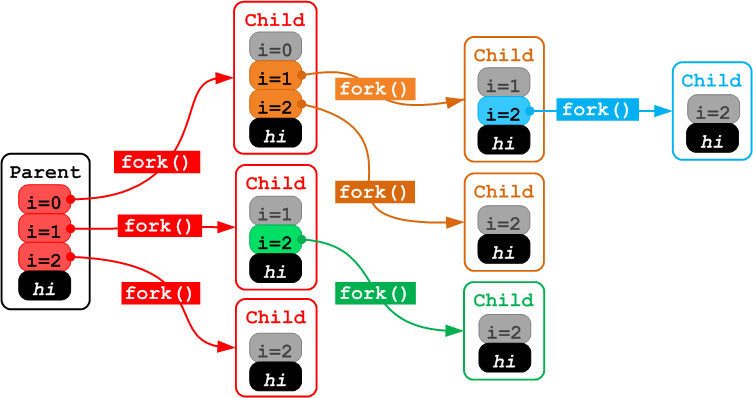

## Linux 系统进程与线程生命周期

### Basic

- 进程是系统分配资源的最小单位
- 线程是处理机调度的最小单位

Linux 系统中，`进程`与`线程`的不像在 Windows 中特别区分，线程仅仅被视为一个与其他线程共享某些资源的进程。下面从 Linux 系统中基本函数 `exec()`,`fork()`,`wait()`来分析 Linux 系统的进程管理。

### Process

#### `exec()`

#### `fork()`

在类 Unix 系统中，除内核进程、init 进程(PID=1)以外，新进程都衍自系统调用`fork()`。

fork 函数很特别，返回两次，分别给父子进程返回 子进程的 PID 和 0， 若出现以下情况：① 系统限制 ② 内存/资源不足，则会 fork 失败返回-1。以下是偷来的一个很助于理解该函数的[例子](https://stackoverflow.com/questions/26793402/visually-what-happens-to-fork-in-a-for-loop)

一旦父进程退出，子进程就被挂到PID 1 下,所以可以看到很多父进程PID为1的进程
```C
#include <stdio.h>

void main()
{
   int i;
   for (i=0;i<3;i++)
   {
      fork();
      // getppid(): gets the parent process-id
      // getpid(): get child process-id
      printf("[%d] [%d] i=%d\n", getppid(), getpid(), i);
   }
   printf("[%d] [%d] hi\n", getppid(), getpid());
}
```

附图理解：



在`htop`中可以看到它漂亮的树型结构，父子进程关系是这样的


#### `wait()`
