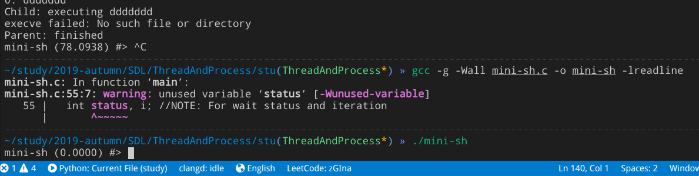

## Linux 系统进程与线程生命周期

### Basic

- 进程是系统分配资源的最小单位
- 线程是处理机调度的最小单位

Linux 系统中，`进程`与`线程`的不像在 Windows 中特别区分，线程仅仅被视为一个与其他线程共享某些资源的进程，它们都被称之为`Task`（kernel data structure: task_struct）。下面从 Linux 系统中基本函数 `exec()`,`fork()`,`wait()`来分析 Linux 系统的进程管理。

### Process

#### `exec()`

`man 3 exec`

#### `fork()`

在类 Unix 系统中，除内核进程(?)、init 进程(PID=1)以外，新进程都衍自系统调用`fork()`。

fork 函数很特别，返回两次，分别给父子进程返回 子进程的 PID 和 0， 若出现以下情况：① 系统限制`/proc/sys/kernel/pid_max` ② 内存/资源不足，则会 fork 失败返回-1。一旦父进程退出，子进程就被挂到 PID 1 下，所以可以看到很多父进程 PID 为 1 的进程。

以下是偷来的一个很助于理解该函数的[例子](https://stackoverflow.com/questions/26793402/visually-what-happens-to-fork-in-a-for-loop)

```C
#include <stdio.h>
void main()
{
   int i;
   for (i=0;i<3;i++)
   {
      fork();
      // getppid(): gets the parent process-id
      // getpid(): get child process-id
      printf("[%d] [%d] i=%d\n", getppid(), getpid(), i);
   }
   printf("[%d] [%d] hi\n", getppid(), getpid());
}
```

附图理解：


在`htop`中可以看到它漂亮的树型结构，父子进程关系是这样的


#### `wait()`

`man 3 wait`

#### [Task&Example](https://www.usna.edu/Users/cs/aviv/classes/ic221/s17/lab/07/lab.html)

- [`timer`](examples/time.c)

  - 要求是`接收命令及其参数在 shell 中执行，并输出 start、end 时间之差`

  在此例中，先`fork`生成一个子进程，在子进程中使用`execvp(argv[1], argv);`执行命令，父进程`wait`等待子进程的结束并计算时间。注意：

  - exec 从内存中加载程序并执行，从而**替换**了子进程
  - 所以选择在父进程中计时 end ，并 print 时间之差 diff (若在主程序会计时两次(fork~)

  结果如下：

  

  只要是按正常方式退出程序，即可以正确计时

- [`mini-sh`](examples/mini-sh.c)

  拥有了[`exec-fork-wait`](examples/exec_fork_wait.c)循环我们就拥有了一个 shell 所具有的最基本的功能！所以可以来制造一个 mini-shell 了

  step 1：`token-sh` 对输入的字符串流处理

  - 判断 `空行`，`EOF`等
  - 以空格分割，\*cmd_argv[ ] 接收参数

  step 2: `while`不断接受新输入，再加入上述的 `exec-fork-wait`循环和 timer.c 功能

  这样得到一个可以计时的 shell 　如下
  

  但是如果 ctrl+c 或 ctrl+z 会结束 mini-shell 回到系统自己的 shell

### Thread

#### POSIX

一种Unix系统特定的实现标准，其余很多系统均兼容，包括Windows

## reference
